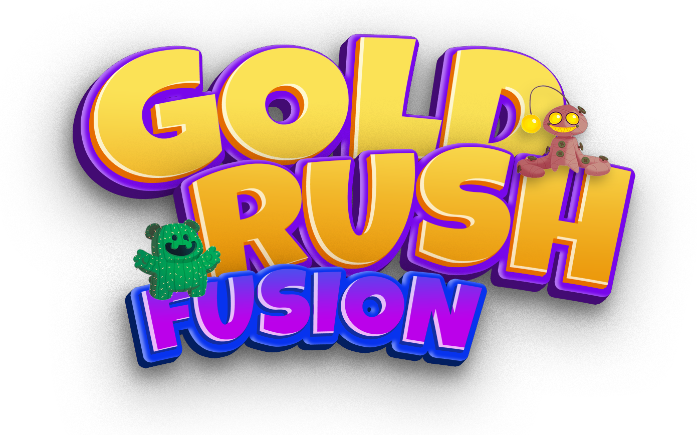
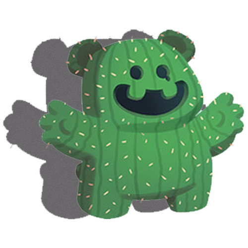

# GoldRushFusion

**GoldRushFusion** es un portal de aprendizaje gamificado donde los profesores suben tareas y los alumnos son recompensados por su rendimiento académico. Los puntos obtenidos pueden ser utilizados para personalizar Pokémons, haciendo del proceso educativo algo entretenido y motivador. ¡Es como Moodle o Classroom, pero con un toque de aventura y juego!

## 🚀 Características Principales

- **Tareas y Evaluaciones**: Los profesores pueden crear y subir tareas, exámenes y evaluaciones.
- **Sistema de Recompensas**: Los alumnos reciben puntos en función de sus calificaciones.
- **Personalización de Pokémons**: Los alumnos pueden gastar sus puntos para desbloquear y personalizar sus Pokémons.
- **Ranking y Logros**: Los estudiantes compiten en tablas de clasificación basadas en sus puntos y logros obtenidos.
- **Gamificación Completa**: El sistema está diseñado para fomentar la participación activa y mejorar el rendimiento a través de la gamificación.

## 🛠️ Tecnologías Utilizadas

- **Frontend**: Angular
- **Backend**: Laravel
- **Base de Datos**: MySQL
- **Autenticación**: JWT para la gestión segura de sesiones
- **Integración de APIs**: API para gestionar puntos, tareas y la personalización de Pokémons

## 🎯 Objetivo

GoldRushFusion busca transformar el aprendizaje en una experiencia interactiva, divertida y productiva, motivando a los estudiantes a participar activamente en su educación mientras se divierten personalizando sus personajes y alcanzando nuevos logros.

## 👾 Gamificación

Los estudiantes pueden personalizar sus Pokémons, desbloquear skins, habilidades y objetos especiales usando los puntos obtenidos en las tareas. El sistema está diseñado para recompensar tanto el esfuerzo como el rendimiento.

## 💡 Integración para Profesores

Los profesores pueden gestionar tareas, ver el progreso de sus alumnos, y utilizar el sistema de recompensas para motivar a los estudiantes, haciendo del aprendizaje una experiencia dinámica y atractiva.

---

Contribuye y mejora **GoldRushFusion** con tus ideas, sugerencias o reportando problemas. ¡Ayuda a construir la mejor plataforma de aprendizaje gamificada!
